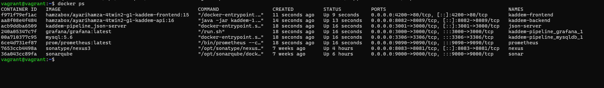
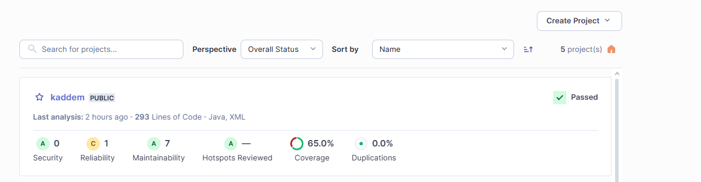
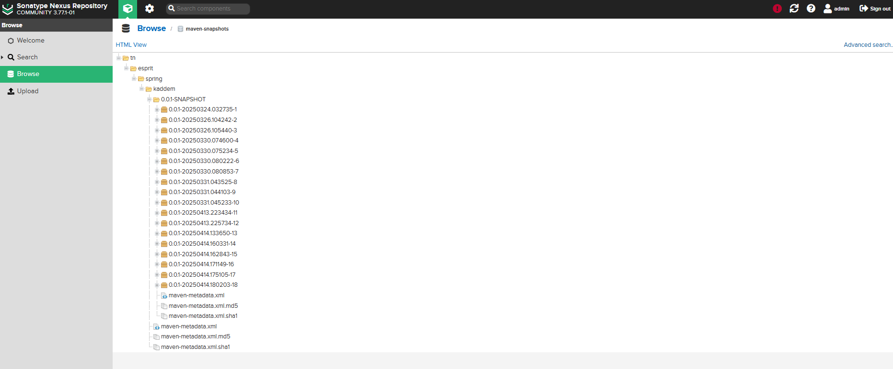
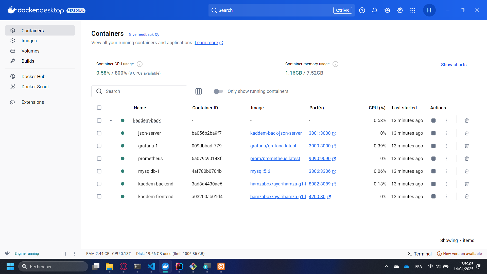
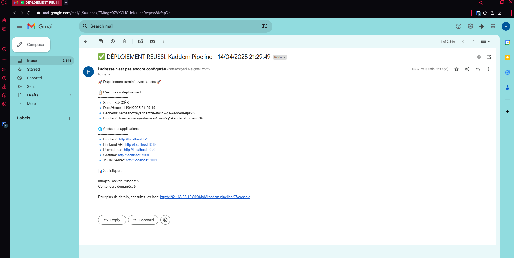
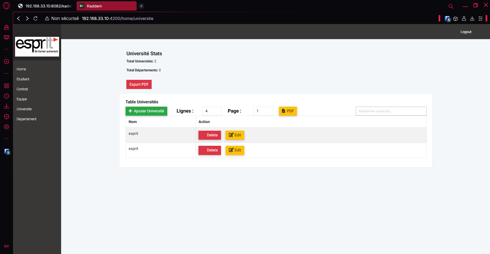
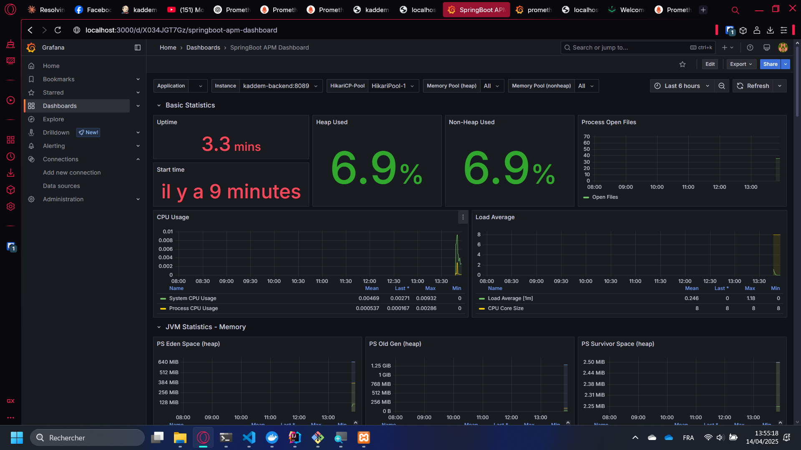
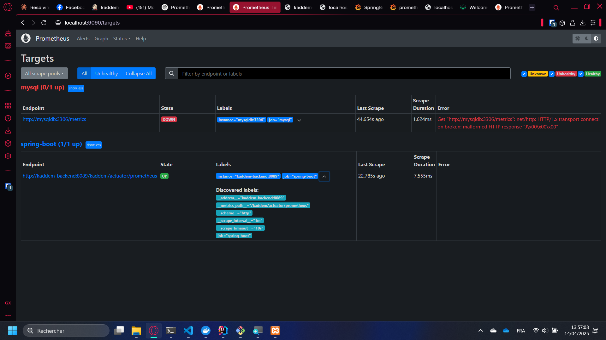

# DevOps-Project-Kaddem
✅ Préparation de l’environnement Jenkins et récupération des projets
🎯 Mise en place de Jenkins, configuration des outils nécessaires (Maven, JDK), et récupération des sources des projets (backend et frontend) via GitHub.

✅ Configuration du build Maven
🎯 Paramétrage précis du build Maven pour assurer une compilation propre et reproductible, incluant la gestion des dépendances et des phases de build.

✅ Tests unitaires avec JUnit et Mockito
🎯 Mise en place de tests unitaires sur les services du backend pour vérifier la logique métier et assurer la stabilité de l’application à chaque mise à jour.

✅ Analyse de la qualité du code avec SonarQube + JaCoCo
🎯 Intégration de SonarQube pour analyser la qualité du code et du coverage de tests, en utilisant JaCoCo pour générer les rapports de couverture.

✅ Création et publication d'artifacts avec Nexus
🎯 Génération des artifacts (JAR) à partir du projet backend, puis hébergement sur Nexus pour une gestion centralisée et sécurisée des livrables.

✅ Création et déploiement des images Docker sur DockerHub
🎯 Création d’images Docker personnalisées pour le frontend et le backend, puis publication sur DockerHub pour faciliter le déploiement via docker-compose.

✅ Déploiement multi-conteneurs avec Docker Compose
🎯 Déploiement simultané du backend Spring, du frontend Angular, de MySQL, du serveur Prometheus et de Grafana via un fichier docker-compose.yml unifié.

✅ Monitoring avec Prometheus et Grafana
🎯 Intégration de Prometheus pour collecter les métriques de l’application et de Jenkins, avec visualisation en temps réel dans Grafana via des dashboards personnalisés.

✅ Notifications et rapports par email
🎯 Configuration de notifications automatiques par email après chaque exécution de pipeline, avec rapports détaillés sur le statut de chaque étape.

## Voici les étapes clés que j'ai suivies pour assurer le déploiement réussi : 
Compétences : Jenkins · Sonarqube · Nexus · JUnit · graphana · prometheus · DevOps · Docker

